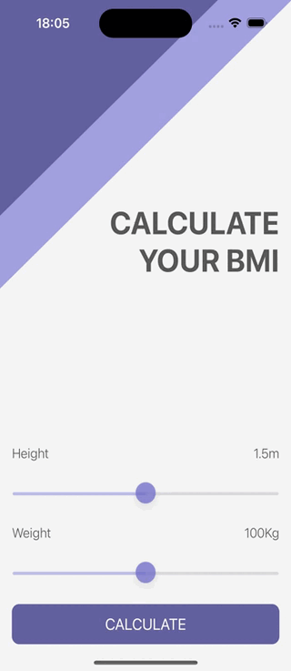

#  BMI Calculator Swift App

## What was do in this app

Body Mass Index calculator. Based on the user’s weight and height it will calculate their body mass and give a piece of health advice depending on whether if they have eaten too many pies or if they need to eat more pies.

## What was used to make this app

* The Swift Programming Language
* Storyboard
* Multi-screen app with animated navigation
* UI elements such as UILabel, UIButton, UIImageView, UIStackView, UISlider

## Example what the application do

